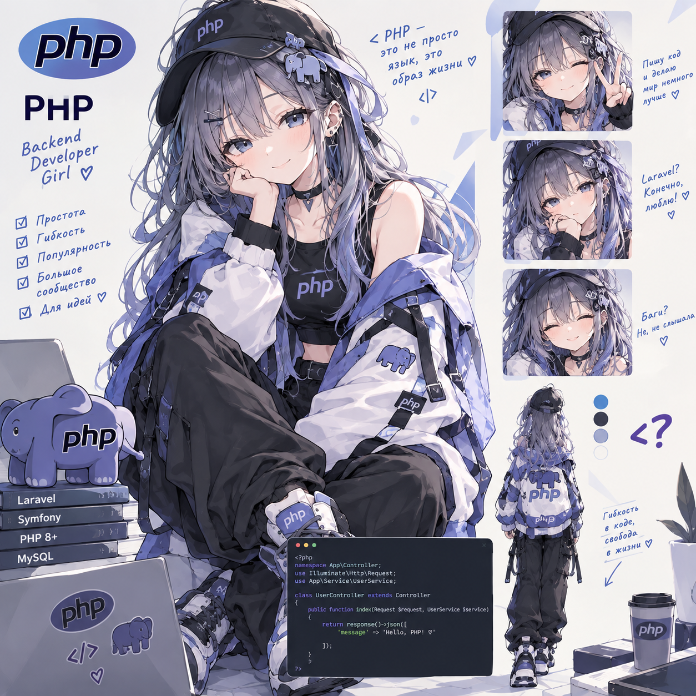

# OOP Lab — Coffee Shop API

> **24.09.2026 — методичка вычитана и исправлена.** Что найдено и что поправлено — в [fixes/php-coffee.md](https://github.com/meeymirita/lab-fixes/blob/main/php-coffee.md) репозитория `lab-fixes`.

**Статус: ⚪ методичка готова, прохождение впереди.**
**Сложность: базовая по материалу** (нужен только синтаксис PHP, фреймворк — с сессии 5), но именно здесь стоит не спешить, если ООП пока даётся тяжело: это фундамент, который потом всплывает во всех остальных лабах.

## О чём

Объектно-ориентированное программирование на PHP 8.4 с нуля — не абстрактно, а на маленьком API кофейни. Отдельный, ни от чего не зависящий проект (в отличие от Redis/RabbitMQ-лаб не растёт из общей системы заказов).

## Стек

Laravel 13 (PHP 8.4) + PostgreSQL 17 + RabbitMQ + Mailpit — брокер появляется только в последней сессии.

## Формат

Методичка [`docs/OOP_Lab_CoffeeShop.html`](docs/OOP_Lab_CoffeeShop.html) — открывается в браузере. Первая сессия начинается с чистого PHP без фреймворка, чтобы увидеть ООП "без магии Laravel".

## Что внутри (5 сессий)

- **Сессия 1** — касса на массивах (и почему это плохо) → первый объект `Money` → `abstract class Drink` + `enum` + полиморфизм → заказ с инвариантами
- **Сессия 2** — тесты для `Money`; иерархия напитков-наследников; фабрика `DrinkType` + `GET /api/menu`
- **Сессия 3** — интерфейс `Beverage`; паттерн **Decorator** для добавок (сироп, шот и т.д.); сущность `Order` + `OrderStatus`; Repository + `POST /api/orders`
- **Сессия 4** — `DiscountPolicy` + `Clock`; чекаут со стратегиями оплаты (`PaymentMethod`) + `/pay`; тесты на стратегиях; эксперимент "а если бы делали через наследование" (чтобы почувствовать разницу с композицией)
- **Сессия 5** — `EventPublisher` + событие `order.paid`; воркеры (бариста + уведомления) на RabbitMQ (один topic-exchange, две очереди — подробно эту схему разберёте позже в RabbitMQ-лабе); сквозной тест без БД и без брокера; финал "до/после"

Проходит через: 4 принципа ООП, `abstract class` vs `interface`, наследование vs композиция, паттерны (Factory, Decorator, Strategy, Repository), SOLID — всё на одном сквозном примере.

Первая сессия с чистым PHP без фреймворка лежит в [`lab0/`](laravel-app/lab0) внутри Laravel-приложения.

---

Часть сборного репозитория лабораторных работ — [anitech-performance](https://github.com/meeymirita/anitech-performance).
